---

layout: default

style: |
    @import('pygments.css');
    #canvas canvas {
        width: 233px !important;
        height: 233px !important;
        margin-right: 5px !important;
    }
    #_ h2 a {
        display: none;
        border-bottom: 1px dotted #eee;
        color: white;
        line-height: 200%;
        font-size: 160px;
        font-weight: normal;
        font-family: 'EBAS';
    }
    #_ p a {
        display: none;
        display: block;
        margin-top: -100px;
        font-family: 'G0V Logo', 'Fira Sans Light', sans-serif !important;
        font-size: 300%;
    }
    #_ p {
        font-family: 'Fira Mono', 'Ubuntu Mono', 'Consolas', 'Menlo', "XinGothic-Citicpress", "Lantinghei TC", "Hiragino Kaku Gothic Pro", "Apple LiGothic", "Heiti TC", "LiHei Pro", "Microsoft YaHei", "微軟正黑體", "文泉驿正黑", monospace !important;
    }

    cite {
        font-family: 'chartjunk';
        font-size: 40px;
        color: white;
    }
    #thank-you h2, #answer h2 {
        margin-left: 0;
        margin-top: 0;
        font-weight: normal;
        font-family: 'Fira Sans Regular', 'Fira Sans OT', 'Fira Sans', 'Ubuntu', 'Source Sans', 'Roboto', "XinGothic-Citicpress", "Lantinghei TC", "Hiragino Kaku Gothic Pro", "Apple LiGothic", "Heiti TC", "LiHei Pro", "Microsoft YaHei", "微軟正黑體", "文泉驿正黑", sans-serif;
    }
    #thank-you > div, #answer > div {
        padding-top: 64px !important;
    }
    #g0v-openhack h2 {
        margin-top: 90px;
        margin-left: -35px;
    }
    #x-blackout h2 {
        margin-top: -70px;
        margin-left: -30px;
    }
    #decentralization h2 {
        color: black !important;
        margin-top: -80px;
        margin-left: 245px;
        display: none;
    }
    body .slide:not(.shout):not(.cover) > div {
        padding-top: 72px;
    }
    @font-face {
        font-family: 'G0V Logo';
        src: url('G0VLogo-Regular.otf?mahjong') format('opentype');
    }
    @font-face {
        font-family: 'chartjunk';
        src: url('chartjunk.otf') format('opentype');
    }
    @font-face {
        font-family: 'Fira Mono';
        src: url('FiraMonoOT-Regular.otf') format('opentype');
    }
    @font-face {
        font-family: 'Fira Sans Light';
        src: url('FiraSansOT-Light.otf') format('opentype');
    }
    @font-face {
        font-family: 'Fira Sans Regular';
        src: url('FiraSansOT-Regular.otf') format('opentype');
    }
    @font-face {
        font-family: 'Fira Sans Medium';
        src: url('FiraSansOT-Medium.otf') format('truetype');
    }
    @font-face {
        font-family: 'EBAS';
        src: url('EBAS-Subset.ttf') format('truetype');
    }
    #_ h2 {
        margin: 0;
        color:#FFF;
        text-align:center;
        font-size:70px;
        }
    #_ p {
        text-align: center;
        color: #FFF;
        font-size: 150%;
        }
        #_ p a {
            text-decoration: none;
            border: none;
            color:#FFF;
            }
    .wrap pre {
        white-space: normal !important
    }
    .slide.cover li em {
        color: #EEE;
        font-style: normal;
        font-family: 'Fira Sans Light', sans-serif !important;
    }
    .slide.cover h2 {
        color: #EEE;
        margin-top: -30px;
        margin-left: -40px;
    }
    #rough-consensus-running-code.shout div h2 em {
        font-style: normal;
        font-weight: bold;
        font-family: 'Fira Sans Medium', sans-serif !important;
    }
    #rough-consensus.shout div h2 {
        font-size: 100px;
        font-family: 'Fira Sans Regular', sans-serif !important;
    }
    #rough-consensus.shout div h2 em {
        font-style: normal;
        font-family: 'Fira Sans Medium', sans-serif !important;
        font-weight: normal !important;
    }
    #big5-utf8.shout div h2 {
        font-family: 'G0V Logo', 'Fira Sans Light', sans-serif !important;
        font-weight: normal !important;
    }
    #twblg h2 {
        display: none;
    }
    span[style="color:#710"] {
        color: #800 !important;
        background: #fafafa !important;
    }

    span[style="color:#D20"] {
        color: #800 !important;
        background: #ffe !important;
        border-radius: 3px !important;
    }
    span[style="color:#F00;background-color:#FAA"] {
        color: #000 !important;
        background: #ffe !important;
        border-radius: 3px !important;
    }
    h2 code {
        background: transparent !important;
        font-weight: normal;
        font-family: 'Fira Mono', 'Ubuntu Mono', 'Consolas', 'Menlo', "XinGothic-Citicpress", "Lantinghei TC", "Hiragino Kaku Gothic Pro", "Apple LiGothic", "Heiti TC", "LiHei Pro", "Microsoft YaHei", "微軟正黑體", "文泉驿正黑", monospace !important;
        font-feature-settings: "zero", "kern";
        -moz-font-feature-settings: "zero", "kern";
        -webkit-font-feature-settings: "zero", "kern";
        color: #666 !important;
    }

    .shout h2 code {
        color: black !important;
    }
    .cover h2 code {
        color: white !important;
        margin-left: -1em;
        }
    body .shout h2 {
        color: #222;
        font-weight: normal !important;
        font-family: "Fira Sans Medium", "XinGothic-Citicpress", "Lantinghei TC", "Hiragino Kaku Gothic Pro", "Apple LiGothic", "Heiti TC", "LiHei Pro", "Microsoft YaHei", "微軟正黑體", "文泉驿正黑", sans-serif !important;
    }
    body .shout code {
        background: transparent;
        font-weight: normal;
    }
    body .shout br {
        line-height: 175%;
    }
    body .slide code {
        background-color: #FAFAC2;
    }
    pre, .slide code {
        white-space: pre !important;
        font-family: 'Fira Mono', 'Consolas', 'Menlo', "XinGothic-Citicpress", "Lantinghei TC", "Hiragino Kaku Gothic Pro", "Apple LiGothic", "Heiti TC", "LiHei Pro", "Microsoft YaHei", "微軟正黑體", "文泉驿正黑", monospace !important;
        font-feature-settings: "zero", "kern", "liga" off;
        -moz-font-feature-settings: "zero", "kern", "liga" off;
        -webkit-font-feature-settings: "zero", "kern", "liga" off;
        }
    pre .line-numbers { display: none }
    body .slide:after { display: none }
    .slide img {
        border-radius: 0.5em;
          box-shadow: 0em 0.2em 0.3em 0px #999999;
    }
    .slide img {
        height: 390px;
    }
    .slide blockquote img, .slide.autosize img {
        height: auto;
    }
    .cover img {
        height: 640px;
    }
    .vertical-top p {
        vertical-align: top;
    }

    .slide {
        text-rendering: optimizeLegibility;
        background: url("themes/ribbon/images/ribbon.svg") no-repeat scroll 865px 0 #fafafa;
    }
    figcaption {
        color: #333;
        font-weight: bold;
        font-family: 'Fira Sans Medium', 'Fira Sans OT', 'Fira Sans', 'Ubuntu', 'Source Sans', 'Roboto', "XinGothic-Citicpress", "Lantinghei TC", "Hiragino Kaku Gothic Pro", "Apple LiGothic", "Heiti TC", "LiHei Pro", "Microsoft YaHei", "微軟正黑體", "文泉驿正黑", sans-serif;
    }
    .slide h2 {
        color: #444;
        margin-left: -10px;
    }
    .slide h2, .slide strong em {
        font-weight: 100; /* Light */
        font-family: 'Fira Sans Light', 'Fira Sans OT', 'Fira Sans', 'Ubuntu', 'Source Sans', 'Roboto', "XinGothic-Citicpress", "Lantinghei TC", "Hiragino Kaku Gothic Pro", "Apple LiGothic", "Heiti TC", "LiHei Pro", "Microsoft YaHei", "微軟正黑體", "文泉驿正黑", sans-serif;
        font-feature-settings: "zero", "liga", "dlig", "kern" on;
        -moz-font-feature-settings: "zero", "liga", "dlig", "kern" on;
        -webkit-font-feature-settings: "zero", "liga", "dlig", "kern" on;
    }
    .slide ul, p {
        font-family: 'Fira Sans Regular', 'Fira Sans OT', 'Fira Sans', 'Ubuntu', 'Source Sans', 'Roboto', "XinGothic-Citicpress", "Lantinghei TC", "Hiragino Kaku Gothic Pro", "Apple LiGothic", "Heiti TC", "LiHei Pro", "Microsoft YaHei", "微軟正黑體", "文泉驿正黑", sans-serif;
        font-feature-settings: "tnum", "zero", "liga", "kern";
        -moz-font-feature-settings: "tnum", "zero", "liga", "kern";
        -webkit-font-feature-settings: "tnum", "zero", "liga", "kern";
    }
    .slide ul li, .slide ol li {
        font-size: 140%;
    }
    .slide ul li li, .slide ol li li {
        font-size: 1em;
    }
    .slide b:before {
        content: '·';
        color: #ccc;
        padding-right: 10px;
        font-size: 30px;
        line-height: 20px;
    }
    .slide strong em {
        color: #333;
        font-style: normal;
    }
    .slide ul li strong, .slide ol li strong, b {
        color: #B00;
        font-family: 'Fira Sans Medium', 'Fira Sans OT', 'Fira Sans', 'Ubuntu', 'Source Sans', 'Roboto', "XinGothic-Citicpress", "Lantinghei TC", "Hiragino Kaku Gothic Pro", "Apple LiGothic", "Heiti TC", "LiHei Pro", "Microsoft YaHei", "微軟正黑體", "文泉驿正黑", sans-serif;
    }
    .shout {
        background: #eee;
    }
    iframe {
        width: 800px;
        height: 400px;
    }

    body .cover figure {
        color: white;
    }
    body figcaption {
        float: right;
        font-style: normal !important;
        font-size: 140%;
    }
    body .cover figcaption {
        color: #ccc;
        margin-top: -0.4em;
        margin-right: 0em;
    }
    body .smaller blockquote {
        font-style: normal !important;
        font-size: 135%;
    }
    body blockquote {
        font-style: normal !important;
        font-size: 150%;
    }
    body .cover blockquote {
        font-style: normal;
        font-size: 180%;
        margin-left: 3em;

    }
---

# [萌典](https://moedict.tw/) {#_}

<!-- by-nc-sa orkomedix, https://secure.flickr.com/photos/orkomedix/6812055939 -->

## g0v.tw
{:#buzz}
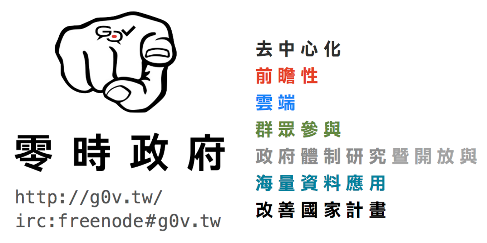

## HTML ←

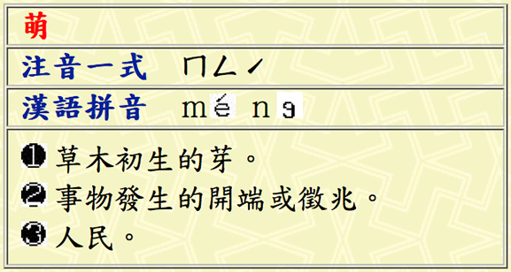

## JSON →

~~~ json
{ "title":    "萌",
  "bopomofo": "ㄇㄥˊ",
  "pinyin":   "méng",
  "definitions": [
    {"type": "名", "def": "草木初生的芽。"},
    {"type": "名", "def": "事物發生的開端或徵兆。"},
    {"type": "名", "def": "人民。"} ] }
~~~

## HTML5 ♡
{:#html5-heart}

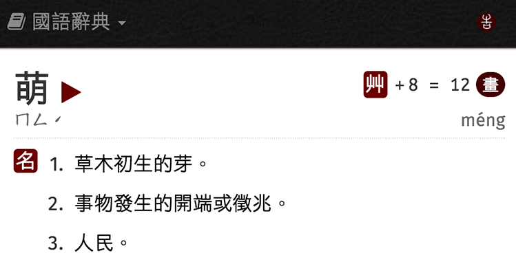

## 寫程式 __改造社會__
{:.shout #g0v-slogan}

## 拆政府 __原地重建__
{:.shout #g0v-slogan-2}

## Flash ←

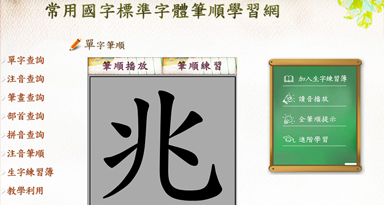

## XML →

~~~ xml
<Word version="1.0" unicode="兆"><Stroke>
  <Outline>
    <MoveTo x="682.0" y="988.0" />
    <QuadTo flexible="false" x1="684.0"
            y1="961.0" x2="687.5" y2="921.5" />
  </Outline>
  <Track><MoveTo x="740.0" y="362.0" /></Track>
</Stroke></Word>
~~~

## HTML5 ♡
{:#canvas}

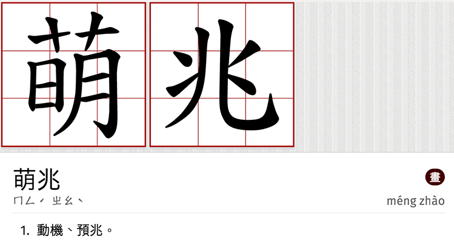

## Revised MoE Dictionary (1994)

## The Good

* <strong>**160,000+**</strong> entries
* Official, **high quality** sources
* Rich **etymology** and historical usage
* Full text search with **regular expressions**
* Still frequently updated!

## The Bad

* Results are **not bookmarkable**
* Requires **N clicks** to get to a definition
* Rare characters become **low-res bitmaps**
* Difficult to use on **mobile devices**
* &#x201C;Optimized for **IE 5.0** and **Netscape 4.7+**&#x201D;!?

## .…and the Very Crazy
{:.autosize}

* 不需登入的網頁，會自動把你登出！

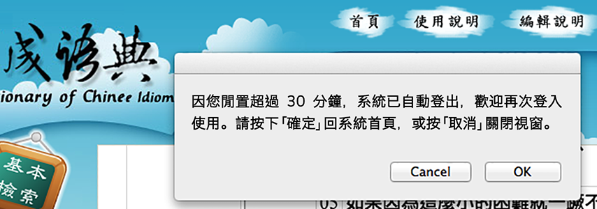

## .…and the Very Crazy
{:.autosize #very-crazy-2}

* 不需登入的網頁，會自動把你登出！

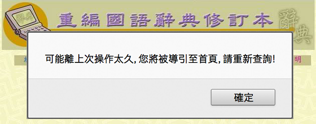

## Yeh's Ping, 2013.1.26.

<figure markdown="1">
> 所以我要 **響應** 零時政府 g0v.tw 的活動，來做 3du.tw，把字、詞、成語、定義、例句等等正體中文資料，用開放的文字 API 釋放出來，加上索引和搜尋的功能，讓任何想加值的個人或公司都可以使用。 
<figcaption>／葉平 〈還文於民〉</figcaption>
</figure>

## Hackpad for 3du.tw

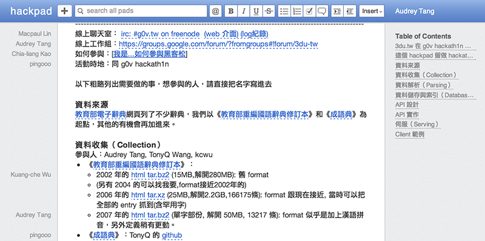

## 零時黑客 集體砍站事件
{:.shout #g0v-scraping}

## g0v hackath1n, 2013.1.27.

* …Scrape 2741 idioms as **HTML** ___(@TonyQ, @MnO2)___
* …Scrape 3000 characters as raw **HTML** ___(@au)___
* …Design **JSON schema** from samples ___(@pingooo)___
* …Design **SQL schema** from samples ___(@albb0920)___
* …**Parse** HTML into JSON & SQLite ___(@kcwu)___
* ……and for those **24x24 bitmaps**...

## &#x1f01d;←`Big-5` &#x1f00e;→`UTF-8`
{:.shout #big5-utf8}

## Crowd-OCR for 1000+ glyphs

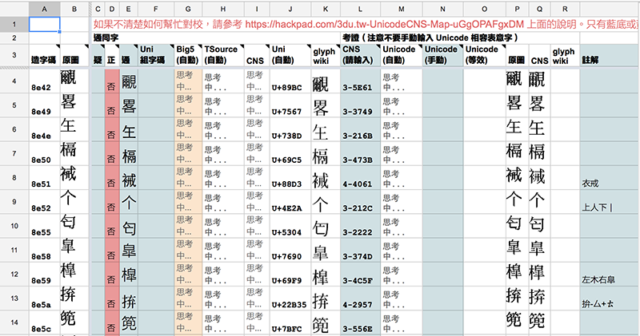

## Finished in 24 hours!
{:.autosize}

Thanks to: ___Favonia, Jun-Yuan Yan, Yao Wei, Yaoting Huang, Poka, Caasi Huang, Daniel Liang, Grey Lee, Irvin Chen, Gugod, Schee…___
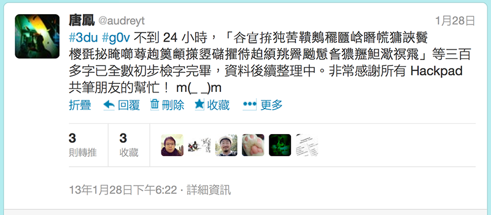

## Rough Consensus *&amp;* *Running Code*
{:.shout #rough-consensus}

## 粗略的共識 *進擊の程式*
{:.shout #rough-consensus-running-code}

## Applications

* <strong>**XUL**</strong> Desktop App ___(@racklin)___
* **OS X** Dictionary ___(@yllan)___
* **Windows 8** App ___(@wenpei)___
* **iOS** Client ___(@tomjpsun, @jamessa, @pct)___
* **iOS** Offline App ___(@zonble)___
 
## Integrations

* <strong>**Rails**</strong> API server ___(@albb0920)___
* **AngularJS** Client+Server ___(@viirya)___
* **Chrome** Extension ___(@tonytonyjan)___
* **Sublime Text** plugin ___(@zonble)___
* **WinRT** Component ___(@eriksk)___

## Fair Use

<figure markdown="1">
> 為非營利之教育目的，依著作權法第 50 條，「以中央或地方機關或公法人之名義公開發表之著作，在合理範圍內，得重製、公開播送或公開傳輸。」此處轉換格式、重新編排的編輯著作權(如果有的話)由 ___@kcwu___ 以 `CC0` 釋出。
</figure>

## CC0: Public Domain

<figure markdown="1">
> 除前述資料檔之外，本目錄下的所有其他檔案，由作者 ___唐鳳___ 在法律許可的範圍內，拋棄該著作依著作權法所享有之權利，包括所有相關與鄰接的法律權利，並宣告將該著作貢獻至公眾領域。
</figure>

## moedict.tw
{:.cover #moedict}
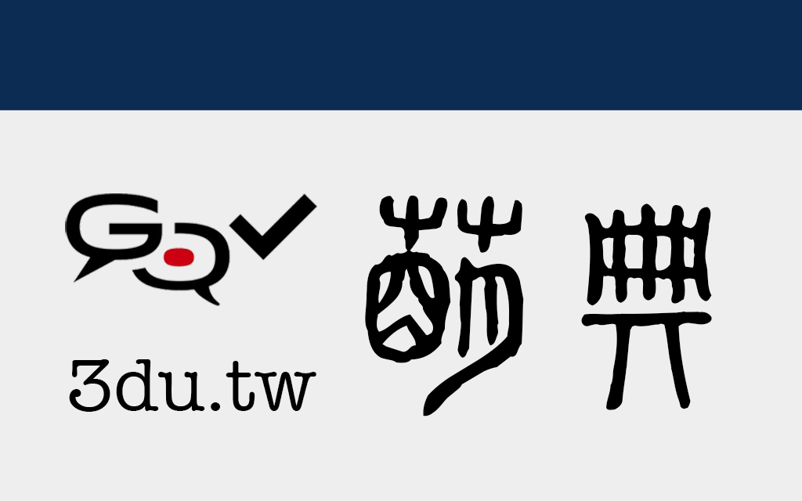

## Timeline

* …2/1: 網站版上線
* …2/3: 行動App上架
* …4/20: 閩南語詞典
* …5/20: 英/法/德語對照
* …6/08: 客家語詞典
* …10/16: 兩岸詞典

## Moe Avatar, 2013.4.29.
{:.cover #avatar}

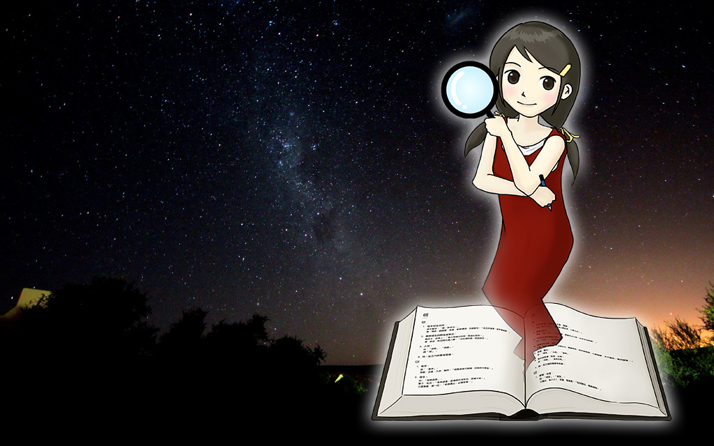

* …___@miau715++___
* …<cite>000111122333444444555555666f</cite>

## Crowd-Proofchecking

* [萌典啄木鳥](https://www.moedict.tw/dodo/) (__@miau715__, __@ETBlue__, __@kcwu__)
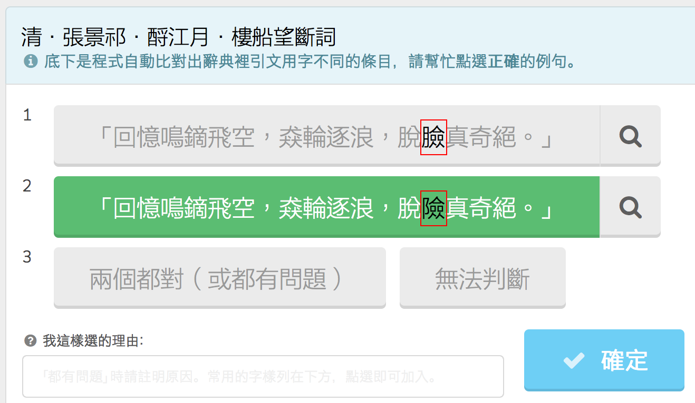

## 5602 edits in 18 days!

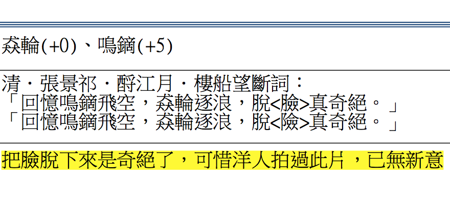

## Stroke Animation

* 筆順補完計畫 (__@kcwu__, __@caasi__, __@miaout17__)
* ...「夯」可用「大」、「力」組成
* ...需要補上非整字的部件，如「礻」「辶」等
* ...用 PostGIS 算部件的相似程度
* ...**國字測繪中心**

## Yahoo Hack Taiwan

> 前一天想到的題目，前兩天剛學的 Three.js，當天早上才拿到資料，一口氣架了五個網站，每個都和活動的主題「解決生活中的問題」 **完全** **沒有** **任何** **關係**，Game Jam 真的很開心！

## g0v.tw 萌典松
{:.cover #answer}

<figure markdown="1">
* 2013/11/23 (六) 11:00 ~ 20:00 
* 台北市大安區泰順街60巷8號B1 
* http://kktix.com/events/moedict
</figure>

<!-- by-nc-sa orkomedix, https://secure.flickr.com/photos/orkomedix/6812055939 -->
