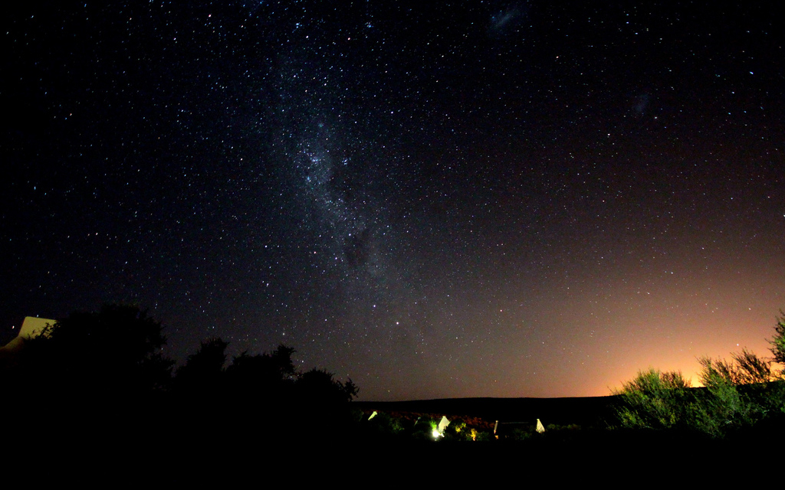

---

layout: default

style: |
    #canvas canvas {
        width: 233px !important;
        height: 233px !important;
        margin-right: 5px !important;
    }
    #_ h2 a {
        border-bottom: 1px dotted #eee;
        color: white;
        line-height: 200%;
        font-size: 160px;
        font-weight: normal;
        font-family: 'EBAS';
    }
    #_ p a {
        display: block;
        margin-top: -100px;
        font-family: 'G0V Logo', 'Fira Sans Light', sans-serif !important;
        font-size: 300%;
    }
    #_ p {
        font-family: 'Fira Mono', 'Ubuntu Mono', 'Consolas', 'Menlo', "XinGothic-Citicpress", "Lantinghei TC", "Hiragino Kaku Gothic Pro", "Apple LiGothic", "Heiti TC", "LiHei Pro", "Microsoft YaHei", "微軟正黑體", "文泉驿正黑", monospace !important;
    }

    cite {
        font-family: 'chartjunk';
        font-size: 40px;
        color: white;
    }
    #thank-you h2, #answer h2 {
        margin-left: 0;
        margin-top: 0;
        font-weight: normal;
        font-family: 'Fira Sans Regular', 'Fira Sans OT', 'Fira Sans', 'Ubuntu', 'Source Sans', 'Roboto', "XinGothic-Citicpress", "Lantinghei TC", "Hiragino Kaku Gothic Pro", "Apple LiGothic", "Heiti TC", "LiHei Pro", "Microsoft YaHei", "微軟正黑體", "文泉驿正黑", sans-serif;
    }
    #thank-you > div, #answer > div {
        padding-top: 64px !important;
    }
    #g0v-openhack h2 {
        margin-top: 90px;
        margin-left: -35px;
    }
    #x-blackout h2 {
        margin-top: -70px;
        margin-left: -30px;
    }
    #decentralization h2 {
        color: black !important;
        margin-top: -80px;
        margin-left: 245px;
        display: none;
    }
    body .slide:not(.shout):not(.cover) > div {
        padding-top: 72px;
    }
    @font-face {
        font-family: 'G0V Logo';
        src: url('G0VLogo-Regular.otf?mahjong') format('opentype');
    }
    @font-face {
        font-family: 'chartjunk';
        src: url('chartjunk.otf') format('opentype');
    }
    @font-face {
        font-family: 'Fira Mono';
        src: url('FiraMonoOT-Regular.otf') format('opentype');
    }
    @font-face {
        font-family: 'Fira Sans Light';
        src: url('FiraSansOT-Light.otf') format('opentype');
    }
    @font-face {
        font-family: 'Fira Sans Regular';
        src: url('FiraSansOT-Regular.otf') format('opentype');
    }
    @font-face {
        font-family: 'Fira Sans Medium';
        src: url('FiraSansOT-Medium.otf') format('truetype');
    }
    @font-face {
        font-family: 'EBAS';
        src: url('EBAS-Subset.ttf') format('truetype');
    }
    #_ h2 {
        margin: 0;
        color:#FFF;
        text-align:center;
        font-size:70px;
        }
    #_ p {
        text-align: center;
        color: #FFF;
        font-size: 150%;
        }
        #_ p a {
            text-decoration: none;
            border: none;
            color:#FFF;
            }
    .wrap pre {
        white-space: normal !important
    }
    .slide.cover li em {
        color: #EEE;
        font-style: normal;
        font-family: 'Fira Sans Light', sans-serif !important;
    }
    .slide.cover h2 {
        color: #EEE;
        margin-top: -30px;
        margin-left: -40px;
    }
    #rough-consensus-running-code.shout div h2 em {
        font-style: normal;
        font-weight: bold;
        font-family: 'Fira Sans Medium', sans-serif !important;
    }
    #rough-consensus.shout div h2 {
        font-size: 100px;
        font-family: 'Fira Sans Regular', sans-serif !important;
    }
    #rough-consensus.shout div h2 em {
        font-style: normal;
        font-family: 'Fira Sans Medium', sans-serif !important;
        font-weight: normal !important;
    }
    #big5-utf8.shout div h2 {
        font-family: 'G0V Logo', 'Fira Sans Light', sans-serif !important;
        font-weight: normal !important;
    }
    #twblg h2 {
        display: none;
    }
    span[style="color:#710"] {
        color: #800 !important;
        background: #fafafa !important;
    }

    span[style="color:#D20"] {
        color: #800 !important;
        background: #ffe !important;
        border-radius: 3px !important;
    }
    span[style="color:#F00;background-color:#FAA"] {
        color: #000 !important;
        background: #ffe !important;
        border-radius: 3px !important;
    }
    h2 code {
        background: transparent !important;
        font-weight: normal;
        font-family: 'Fira Mono', 'Ubuntu Mono', 'Consolas', 'Menlo', "XinGothic-Citicpress", "Lantinghei TC", "Hiragino Kaku Gothic Pro", "Apple LiGothic", "Heiti TC", "LiHei Pro", "Microsoft YaHei", "微軟正黑體", "文泉驿正黑", monospace !important;
        font-feature-settings: "zero", "kern";
        -moz-font-feature-settings: "zero", "kern";
        -webkit-font-feature-settings: "zero", "kern";
        color: #666 !important;
    }

    .shout h2 code {
        color: black !important;
    }
    .cover h2 code {
        color: white !important;
        margin-left: -1em;
        }
    body .shout h2 {
        color: #222;
        font-weight: normal !important;
        font-family: "Fira Sans Medium", "XinGothic-Citicpress", "Lantinghei TC", "Hiragino Kaku Gothic Pro", "Apple LiGothic", "Heiti TC", "LiHei Pro", "Microsoft YaHei", "微軟正黑體", "文泉驿正黑", sans-serif !important;
    }
    body .shout code {
        background: transparent;
        font-weight: normal;
    }
    body .shout br {
        line-height: 175%;
    }
    body .slide code {
        background-color: #FAFAC2;
    }
    pre, .slide code {
        white-space: pre !important;
        font-family: 'Fira Mono', 'Consolas', 'Menlo', "XinGothic-Citicpress", "Lantinghei TC", "Hiragino Kaku Gothic Pro", "Apple LiGothic", "Heiti TC", "LiHei Pro", "Microsoft YaHei", "微軟正黑體", "文泉驿正黑", monospace !important;
        font-feature-settings: "zero", "kern", "liga" off;
        -moz-font-feature-settings: "zero", "kern", "liga" off;
        -webkit-font-feature-settings: "zero", "kern", "liga" off;
        }
    pre .line-numbers { display: none }
    body .slide:after { display: none }
    .slide img {
        border-radius: 0.5em;
          box-shadow: 0em 0.2em 0.3em 0px #999999;
    }
    .slide img {
        height: 390px;
    }
    .slide blockquote img, .slide.autosize img {
        height: auto;
    }
    .cover img {
        height: 640px;
    }
    .vertical-top p {
        vertical-align: top;
    }

    .slide {
        text-rendering: optimizeLegibility;
        background: url("themes/ribbon/images/ribbon.svg") no-repeat scroll 865px 0 #fafafa;
    }
    figcaption {
        color: #333;
        font-weight: bold;
        font-family: 'Fira Sans Medium', 'Fira Sans OT', 'Fira Sans', 'Ubuntu', 'Source Sans', 'Roboto', "XinGothic-Citicpress", "Lantinghei TC", "Hiragino Kaku Gothic Pro", "Apple LiGothic", "Heiti TC", "LiHei Pro", "Microsoft YaHei", "微軟正黑體", "文泉驿正黑", sans-serif;
    }
    .slide h2 {
        color: #444;
        margin-left: -10px;
    }
    .slide h2, .slide strong em {
        font-weight: 100; /* Light */
        font-family: 'Fira Sans Light', 'Fira Sans OT', 'Fira Sans', 'Ubuntu', 'Source Sans', 'Roboto', "XinGothic-Citicpress", "Lantinghei TC", "Hiragino Kaku Gothic Pro", "Apple LiGothic", "Heiti TC", "LiHei Pro", "Microsoft YaHei", "微軟正黑體", "文泉驿正黑", sans-serif;
        font-feature-settings: "zero", "liga", "dlig", "kern" on;
        -moz-font-feature-settings: "zero", "liga", "dlig", "kern" on;
        -webkit-font-feature-settings: "zero", "liga", "dlig", "kern" on;
    }
    .slide ul, p {
        font-family: 'Fira Sans Regular', 'Fira Sans OT', 'Fira Sans', 'Ubuntu', 'Source Sans', 'Roboto', "XinGothic-Citicpress", "Lantinghei TC", "Hiragino Kaku Gothic Pro", "Apple LiGothic", "Heiti TC", "LiHei Pro", "Microsoft YaHei", "微軟正黑體", "文泉驿正黑", sans-serif;
        font-feature-settings: "tnum", "zero", "liga", "kern";
        -moz-font-feature-settings: "tnum", "zero", "liga", "kern";
        -webkit-font-feature-settings: "tnum", "zero", "liga", "kern";
    }
    .slide ul li, .slide ol li {
        font-size: 140%;
    }
    .slide ul li li, .slide ol li li {
        font-size: 1em;
    }
    .slide b:before {
        content: '·';
        color: #ccc;
        padding-right: 10px;
        font-size: 30px;
        line-height: 20px;
    }
    .slide strong em {
        color: #333;
        font-style: normal;
    }
    .slide ul li strong, .slide ol li strong, b {
        color: #B00;
        font-family: 'Fira Sans Medium', 'Fira Sans OT', 'Fira Sans', 'Ubuntu', 'Source Sans', 'Roboto', "XinGothic-Citicpress", "Lantinghei TC", "Hiragino Kaku Gothic Pro", "Apple LiGothic", "Heiti TC", "LiHei Pro", "Microsoft YaHei", "微軟正黑體", "文泉驿正黑", sans-serif;
    }
    .shout {
        background: #eee;
    }
    iframe {
        width: 800px;
        height: 400px;
    }

    body .cover figure {
        color: white;
    }
    body figcaption {
        float: right;
        font-style: normal !important;
        font-size: 140%;
    }
    body .cover figcaption {
        color: #ccc;
        margin-top: -0.4em;
        margin-right: 0em;
    }
    body .smaller blockquote {
        font-style: normal !important;
        font-size: 135%;
    }
    body blockquote {
        font-style: normal !important;
        font-size: 150%;
    }
    body .cover blockquote {
        font-style: normal;
        font-size: 180%;
        margin-left: 3em;

    }
---

# [萌典](https://moedict.tw/) {#_}

[G](http://g0v.tw/)

<!-- by-nc-sa orkomedix, https://secure.flickr.com/photos/orkomedix/6812055939 -->

## 兩個月以來的進度
{:#recap}

* 萌典啄木鳥 (@miau715, @ETBlue, @kcwu)
    * 18 天，5602 筆修訂
    * 共送出 500 頁的 PDF
* 分類檢索、部首表上線 (@poga, @muan)
* 離線筆順動畫上線 (@kcwu, @caasi)
* 漢字標準格式 CSS v2.1 (@ethantw)

## 兩岸詞典
{:#csld}

* <https://moedict.tw/~萌> (@bresson, @wjw)
* Android 已發佈，iOS 審核中
* TODO: 跨語交叉檢索設計
* TODO: 排版設計
* Needs: Design, Testing

## 筆順動畫
{:#stroke}

* 離線動畫 18M → 3.4M (@kcwu, @caasi)
* 部件補缺字資料 (@miaout17)
* TODO: 使用部件實際長寬組字
* TODO: 補上非整字的部件，如礻辶等
* Needs: Code, Chinese

## 分享鏈結
{:#share}

* oEmbed
* OpenGraph

## 離線語音包
{:#audio}

* 各語種成為獨立 App 

## 各式各樣的坑
{:#issues}

* 書籤紀錄 (Design, JS)
* 字型呈現校正 (Typographer, JS)
* 手勢操作界面 (UX Design)
* 全文檢索 (Technical Review)

## Thank you!
{:.cover #answer}

<figure markdown="1">
> 新的轉機和閃閃星斗， 
> 正在綴滿沒有遮攔的天空。 
> 那是五千年的象形文字， 
> 那是未來人們凝視的眼睛。
<figcaption>／北島 〈回答〉</figcaption>
</figure>

<!-- by-nc-sa orkomedix, https://secure.flickr.com/photos/orkomedix/6812055939 -->
